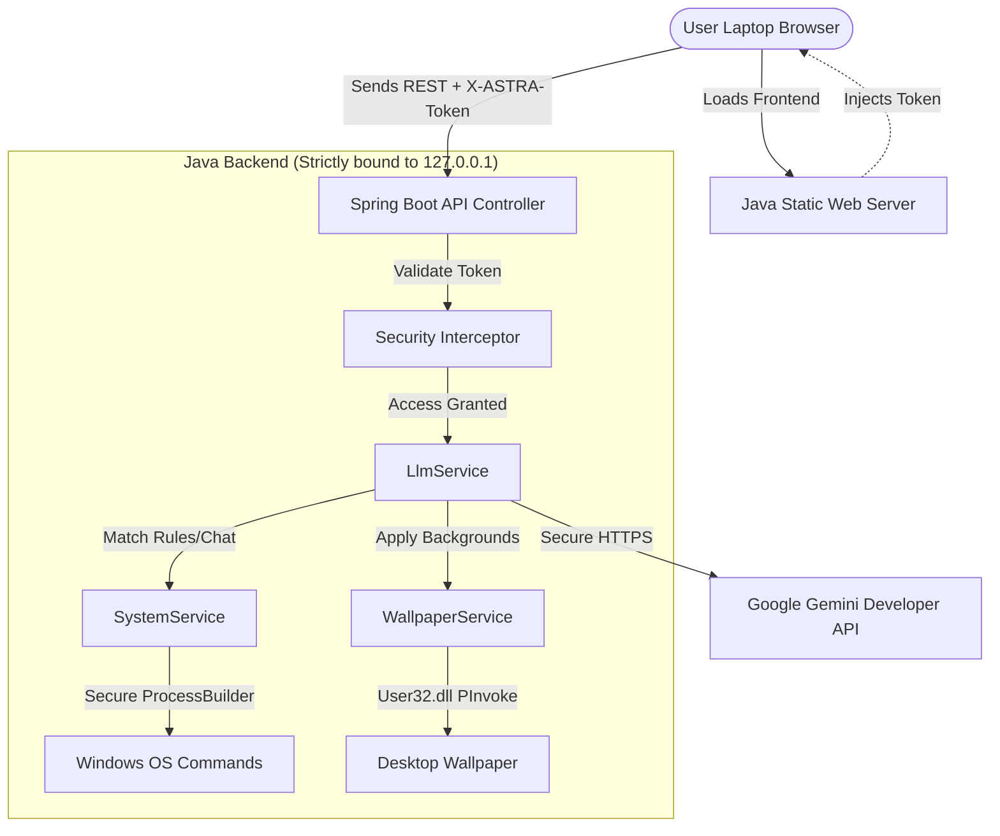

# 🌌 ASTRA: Secure Local AI Laptop Assistant

```
    ▲   ███████╗████████╗██████╗  █████╗ 
   / \  ██╔════╝╚══██╔══╝██╔══██╗██╔══██╗
  /   \ ███████╗   ██║   ██████╔╝███████║
 /     \╚════██║   ██║   ██╔══██╗██╔══██║
/_______\███████║  ██║   ██║  ██║██║  ██║
        ╚══════╝   ╚═╝   ╚═╝  ╚═╝╚═╝  ╚═╝
```

**ASTRA** is a premium, secure, self-hosted AI Desktop Assistant built specifically for Windows laptops. It combines a robust **Java (Spring Boot 3)** systems control engine with a stunning, high-performance **React + TypeScript** web interface. ASTRA lets you control your computer naturally using text commands (like opening project folders in VS Code, launching cmd/PowerShell, cleaning up your desktop, or finding and setting high-definition wallpapers) while remaining completely immune to external hacking or network exploits.

---

## 🛠️ Technology Stack
*   **Backend (Brain)**: Java 21/25, Spring Boot 3.4, Apache Maven
*   **Frontend (UI)**: React 18, Vite 5, TypeScript, Lucide Icons, Vanilla CSS (Glassmorphism design system)
*   **AI Engine**: Google Gemini 2.5 API (via local secure JSON REST queries) with an offline Regex Fallback Parser
*   **System Bridge**: Windows PowerShell & `ProcessBuilder` OS integrations (safely executes tasks without exposing dangerous shell execution interfaces)

---

## 🛡️ Security Architecture: Why ASTRA Cannot Be Hacked
Your laptop security is the #1 priority. ASTRA employs a zero-trust model consisting of three impenetrable defense layers:

1.  **Local Loopback Binding Only (`127.0.0.1`)**  
    The Spring Boot server is configured to bind *strictly* to `127.0.0.1` (localhost). This means **all** network ports are completely closed to your local home/school Wi-Fi, external local area networks, or the wide-area internet. No outside computer can query, connect to, or ping ASTRA.
2.  **Cryptographic Handshake Security (`X-ASTRA-Token`)**  
    On startup, the Java backend generates a cryptographically secure random 32-character session token. When you open the webpage, the backend dynamically injects this token into the browser origin DOM. Every single system API request `/api/**` requires this token inside the `X-ASTRA-Token` HTTP header. 
    *   *Why this matters*: Even if you visit a malicious site in another browser tab, and it attempts a Cross-Origin Request Request (CSRF) or DNS Rebinding exploit to access `http://localhost:8080/api/system/vscode`, the browser sandbox blocks that tab from reading ASTRA's origin DOM. The request will fail verification and be rejected with an `HTTP 401 Unauthorized`.
3.  **Process Isolation & Command Injection Shield**  
    ASTRA never passes raw user text directly into command-line shells (which could lead to command injection like running `rm -rf` or `format C:`). Instead, paths and directories are parsed, validated to ensure they exist on the filesystem, and executed using strict array-based inputs inside Java's `ProcessBuilder`.

### 📊 System Architecture



---

## 🚀 Getting Started (Installation & Launch)

### 📋 Prerequisites
Make sure your Windows laptop has the following software installed (already verified on your system):
*   **Java Development Kit (JDK)**: Version 21 or newer (your system has Java 25)
*   **Node.js & npm**: For building the user interface (your system has Node 24)
*   **Apache Maven**: For building the backend (your system has Maven 3.9)

### 📥 Cloning & Setup
Clone this repository to your local machine:
```bash
git clone https://github.com/Pranav2k05/ASTRA-AI.git
cd ASTRA-AI
```

### ⚡ One-Click Startup (Recommended)
1.  Navigate to your workspace root directory: `C:\Users\User\Desktop\ProjectClge\ASTRA`
2.  Double-click the **`run.bat`** file.
3.  This boots the loader script, which will:
    *   Initialize the project.
    *   Compile the frontend assets and link them to the backend statically.
    *   Run the Maven Java Compiler.
    *   Launch the secure server.
    *   Automatically open your default browser to [http://localhost:8080](http://localhost:8080).
4.  Keep the command prompt window open while you use ASTRA. Press `CTRL + C` in that window when you are ready to turn ASTRA off.

---

## 💡 How To Use ASTRA

### 🔑 Setting up the AI (First-Time Only)
1.  Once the web interface loads, click on the **Brain Settings** tab in the sidebar.
2.  Paste your Google Gemini API Key. You can get a free key from [Google AI Studio Console](https://aistudio.google.com/).
3.  Click **Save Key**. The key is stored locally in `C:\Users\User\.astra\config.json` (never shared or uploaded anywhere else).

### 💬 Sample Natural Language Prompts
In the **AI Dialogue** tab, type anything you want to run! Here are some examples:
*   **Open Directories in VS Code**:
    *   `open vscode C:\Users\User\Desktop\ProjectClge\ASTRA`
    *   `open my documents folder in vs code`
*   **Launch Terminals**:
    *   `open terminal` (Opens Command Prompt in your user directory)
    *   `open powershell C:\Users\User\Documents` (Opens PowerShell in your documents folder)
*   **Clean and Organize Your Desktop**:
    *   `organize desktop`
    *   `clean up my desktop`
    *   *(Note: This sweeps loose files on your desktop and organizes them into categorised folders: Images, Documents, Archives, Installers, Video, Audio, Code, etc.)*
*   **Change Desktop Wallpapers**:
    *   `search wallpapers cyber neon`
    *   `find wallpaper space galaxy`
    *   *(Note: This queries Unsplash's public registry. You can browse the results in the chat and click **Set Desktop Background** to apply the wallpaper instantly!)*
*   **General Chat**:
    *   `What projects are under C:\Users\User\Desktop?`
    *   `Write a quick Python script to rename files`

---

## 📁 Project Structure

```
ASTRA/
│
├── run.bat                     # Windows Explorer launcher (Double-click to start)
├── run.ps1                     # PowerShell Orchestrator script
├── README.md                   # This instruction manual
│
├── backend/                    # Java Maven Spring Boot Project
│   ├── pom.xml                 # Maven dependency management
│   └── src/main/
│       ├── java/com/astra/assistant/
│       │   ├── AstraApplication.java       # Server Boot class
│       │   ├── config/                     # Security configuration & Interceptors
│       │   ├── controller/                 # ViewController & Secured ApiController
│       │   └── service/                    # OS, Wallpaper, LLM, & Config engines
│       └── resources/
│           ├── application.properties      # Network server bindings (127.0.0.1)
│           └── static/                     # Target folder for built UI assets
│
└── frontend/                   # React + Vite + TS UI Project
    ├── package.json            # Web dependency configuration
    ├── vite.config.ts          # Build setup (proxies /api to 8080, builds to backend/static)
    ├── index.html              # Core single-page HTML
    └── src/
        ├── main.tsx            # React Mount entrypoint
        ├── App.tsx             # Main tab controller & Sidebar Shell
        ├── index.css           # Premium Glassmorphism styling sheets
        └── components/         # Chat, System Controls, Security, & Settings views
```

---

## 🛡️ Data Storage Isolation
All configurations and temporary downloads are stored locally on your hard disk under:
*   `C:\Users\<Your-Username>\.astra\`
    *   `config.json`: Stores your API key and other local preferences securely.
    *   `wallpapers\`: Caches downloaded images applied to your desktop.
